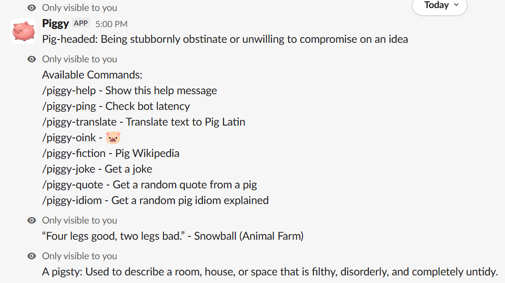

# Piggy
Piggy is a 24/7 Slack bot that has commands all to do with pigs.

 An example of Piggy in action.

List of Commands:
* /piggy-help - Shows a help message
* /piggy-ping - Check bot latency
* /piggy-translate - Translate text to Pig Latin
* /piggy-oink - Oinks
* /piggy-fiction - Pig Wikipedia
* /piggy-joke - Get a joke
* /piggy-quote - Get a random quote from a pig
* /piggy-idiom - Get a random pig idiom explained

How to use Piggy:

* Piggy is already installed in the Hack Club Slack workspace. Go to the Hack Club Slack and run commands starting with /piggy- (see above).

Note: To use /piggy-translate, you have to put the text you want to translate after the command, e.g.

Input: /piggy-translate Hello world this is piggy translate

Output: elloHay orldway isthay isway iggypay anslatetray 🐷

This was a fun project that helped me to learn JavaScript (I only knew a little bit from doing Sprig tutorials) and also how to make a Slack bot.

This was built by me for Hack Club Stardance.